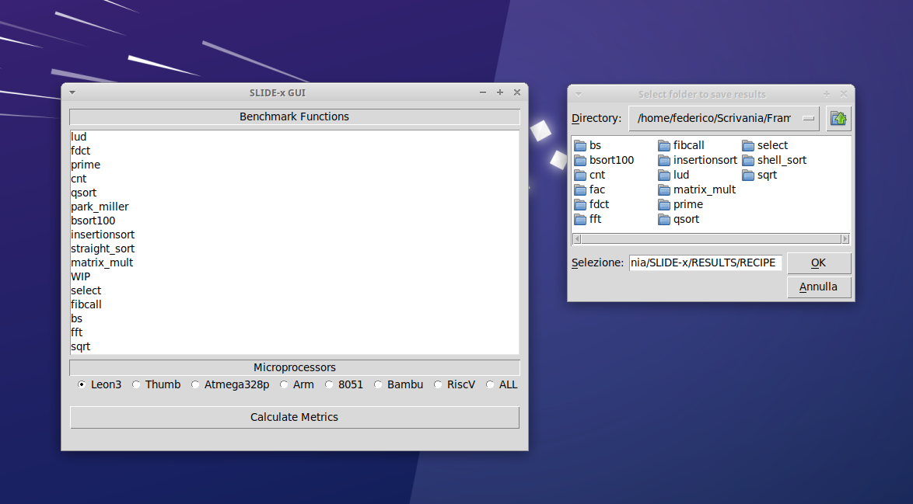

# SLIDE-x
**S**ystem-**L**evel **I**nfrastructure for HW/SW **D**ataset **E**-**x**traction

<p></p>

[](https://www.gnu.org/licenses/gpl-3.0)

## Installation instructions

### OVERVIEW
SLIDE-x is an open-source Python tool that facilitates the System-Level HW/SW Co-Design of embedded systems and Cyber-Physical Systems (CPSs) through the creation of datasets useful for analysis, comparison, and simulations/predictions. These datasets can be used to evaluate HW/SW performance, select the most suitable embedded platform, and perform HW/SW trade-off analysis.

### SLIDE-x Main Components
SLIDE-x consists of the following components:

1. **SLIDE-x-BENCH**: Extensible C-based benchmark component for evaluating HW/SW performance;
2. **SLIDE-x-CORE**: The SLIDE-x core engine component:
   - **SLIDE-x-Data**: Extensible Python Data-driven component, where designers can (semi)automatically generate inputs for the benchmark functions. The function parameters are specified in a JSON file (`cmds.json`) contained in the same directory of the function. The component reads a range `[x; y]` used to generate the values of the parameters and the number of inputs to be created. Finally, for each function, different data types have been considered (i.e., int8, int16, int32, int64, float, and double) to analyze the results for the internal architecture of the considered processor.
   - **SLIDE-x-Code**: Extensible Python Code-driven component, where several code-oriented metrics are extracted by profiling the benchmark functions using the `gcov` and `frama-c` tools for each generated input. It is worth noting that such profiling is performed one-shot on the host platform since it is independent of the target processor technologies.
   - **SLIDE-x-Sim**: Extensible Python HW/SW Simulation-driven component, where designers can execute the benchmark C function using several simulators for different processors. The component saves metrics related to the number of clock cycles, instructions executed, cache miss/hit/access, etc. Depending on the processor technology, an Instruction Set Simulator (ISS) or an HDL Simulator is needed, such as:
     - **SLIDE-x-HLS** Integration with High-Level Synthesis (HLS) tools such as Bambu, Vitis-HLS, and LegUP.
     - **SLIDE-x-ISS** Integration with Instruction Set Simulators (ISS) such as TSIM, Armulator, Thumbulator, Dalton SDCC/ISASIM, SimulAVR, Spike 64-bit RISC-V, x86-64 with Perf.
3. **SLIDE-x-RES**: Result datasets generated during the Profiling/Simulation activities;

SLIDE-x supports synthesis for FPGAs through the **SLIDE-x-FPGA** parser and System-on-Chips (SoCs) through the **SLIDE-x-SoC** parser. Application-Specific Integrated Circuit (ASIC) support is under development.

SLIDE-x can be used to enhance Systel-Level HW/SW Co-Design methodologies, frameworks, and tools functionalities such as HEPSYCODE, a System-Level methodology and tool for HW/SW **CO-DE**sign of **HE**terogeneous **P**arallel dedicated **SY**stems. The enhanced version is called **HEPSYCODE-x**. SLIDE-x can be also used to define metrics for Design Space Exploration (DSE) of embedded systems and CPSs. It has been used in HEPSYCODE to improve the **P**artitioning, **A**rchitecture definition, and **M**apping (PAM) DSE tool. The improved version, called **PAM-x** uses GIMPLE-SSA-OPTIMIZED intermediate representations (IR).

SLIDE-x has been used in the following projects: 
1. **SLIDE-x-ML**: Results with Bambu HLS on various FPGAs (i.e., Stratix-V, Artix-7, Virtex-7, Zynq-700) were used to predict the performance of C functions synthesized as HW components. The project is accessible at the following link: https://github.com/hepsycode/SLIDE-x-ML-ICCD

### WEBSITE
**REMOVED FOR DOUBLE BLIND REVIEW**
<!--
[www.HEPSYCODE.com](https://hepsycode.github.io/)
-->

### DOWNLOAD
SLIDE-x is open-source and freely available on GitHub: https://github.com/hepsycode/SLIDE-x.

### SCREENSHOT

<p></p>

### GETTING STARTED GUIDELINES
The installation of the framework goes through a few simple steps. All that is required is to install the tools exploited by the framework at each step: Profiling (i.e., gcov), Static Analysis (i.e., Frama-c), and Simulation (i.e., ISS/HLS). For a deeper insight into the commands executed to perform each phase, the user can look at the `/SLIDE-x-CORE/src/cmds.json` file.

The framework is implemented in Python3 and uses the csv, os, shutil, subprocess, tkinter libraries for internal operations. Thus, Python3 and the above-listed libraries should be installed for the framework to run properly. 

#### Profiling
The profiling phase requires the execution of [gcc](https://gcc.gnu.org/gcc/) and [gcov](https://gcc.gnu.org/onlinedocs/gcc/Gcov.html).

#### Static Analysis
This step requires the [frama-c](https://frama-c.com/) software analyzer.

#### Simulation 
The simulation phase involves the execution of the toolchain for each processor supported by the framework. The following is a description of each supported processor and the tools needed to get the information required to extract HW/SW metrics:

- **Atmel AVR family**: 
	- **[simulavr](https://www.nongnu.org/simulavr/)**: the instruction set simulator of the Atmel AVR family;
	- **[avr-gcc](https://gcc.gnu.org/wiki/avr-gcc)**: the cross-compiler for the AVR ISA;

- **LEON3**: 
	- **[tsim-leon3](https://www.gaisler.com/index.php/downloads/simulators)**: the instruction set simulator for the LEON3;  
	- **[sparc-gaisler-elf-gcc](https://www.gaisler.com/index.php/downloads/compilers)**: the cross-compiler for the SPARC ISA;

- **Intel MCS-51 (8051)**:
	- **[sdcc](http://sdcc.sourceforge.net/)**: the cross-compiler for the 8051;
   	- **[isasim](http://www.newit.gsu.by/resources/CPUs/i8051/VHDL/Synthesizeable%20VHDL%20Model%20of%208051.htm)**: the simulator of the 8051;
 	- **[isasim zip files](http://www.pomante.net/sito_gg/EmbeddedSystems2324/06_HOMELAB_8051_web.zip)**: 8051 ISS zip package;
	
 - **ARM**:
 	- **[arm-none-eabi-gcc](https://developer.arm.com/downloads/-/gnu-rm)**: the cross-compiler for the ARM architecture;
 	- **Thumbulator**:
	   	- **[thumbulator](https://github.com/hepsycode/Thumbulator)**: the cycle-accurate ARMv6-M (Cortex-M0) simulator;
 	- **Armulator**:
	   	- **[armulator](https://github.com/hepsycode/Armulator)**: the ARM v4T simulator;

 - **RISC-V**:
 	- **[riscv64-unknown-elf-gcc](https://github.com/riscv-collab/riscv-gnu-toolchain/tree/master)**: the cross-compiler for the RiscV;
 	- **[Spike](https://github.com/hepsycode/Riscv-isa-sim)**: the Spike RISC-V ISA Simulator (Functional);

 - **Bambu HLS**:
 	- **[PandA-bambu](https://github.com/hepsycode/PandA-bambu)**: PandA Bambu HLS Framework;

### RELEASE NOTES
Latest Release: 2.0.0
 
### LICENSE
GNU GENERAL PUBLIC LICENSE Version 3, 29 June 2007 (see https://www.gnu.org/licenses/gpl-3.0.en.html)
 
### DEVELOPER RESOURCES
Source Repositories: [https://github.com/hepsycode/SLIDE-x](https://github.com/hepsycode/SLIDE-x)

- Clone: 
    - ssh: [git@github.com:hepsycode/SLIDE-x.git](git@github.com:hepsycode/SLIDE-x.git)
    - https: [https://github.com/hepsycode/SLIDE-x.git](https://github.com/hepsycode/SLIDE-x.git)
 
You can use the code from these repositories to experiment, test, build, and create patches, and issue pull requests (only by request).
For any bug or doubt, contact us or open an issue.
 
### SUPPORT
We currently support: **REMOVED FOR DOUBLE BLIND REVIEW**

<!--
 1. Email: 
    - Vittoriano Muttillo:
       - vittoriano.muttillo@guest.univaq.it,
       - vmuttillo@unite.it
       - vittoriano.muttillo@gmail.com
    - Vincenzo Stoico:
    	- v.stoico@vu.nl
    - (please take care to use \[SLICE-x SUPPORT\] as object
 2. Issues on GitHub
 -->

## Additional information
**REMOVED FOR DOUBLE BLIND REVIEW**
<!-- 
Research publications are available at https://hepsycode.github.io/ and http://www.pomante.net/sito_gg/Publications.htm
-->

## How to Cite?
If you use SLIDE-x in your research, please cite: **REMOVED FOR DOUBLE BLIND REVIEW**
<!--
```
@inproceedings{Muttillo2018,
	author = {Muttillo, Vittoriano and Valente, Giacomo and Pomante, Luigi and
	Stoico, Vincenzo and D'Antonio, Fausto and Salice, Fabio},
	title = {CC4CS: an Off-the-Shelf Unifying Statement-Level Performance Metric
	for HW/SW Technologies},
	year = {2018},
	isbn = {9781450356299},
	publisher = {Association for Computing Machinery},
	address = {New York, NY, USA},
	url = {https://doi.org/10.1145/3185768.3186291},
	doi = {10.1145/3185768.3186291},
	booktitle = {Companion of the 2018 ACM/SPEC International Conference on
	Performance Engineering},
	pages = {119–122},
	numpages = {4},
	keywords = {system-level metrics, embedded systems, HW/SW co-design},
	location = {Berlin, Germany},
	series = {ICPE '18}
}
```
-->
